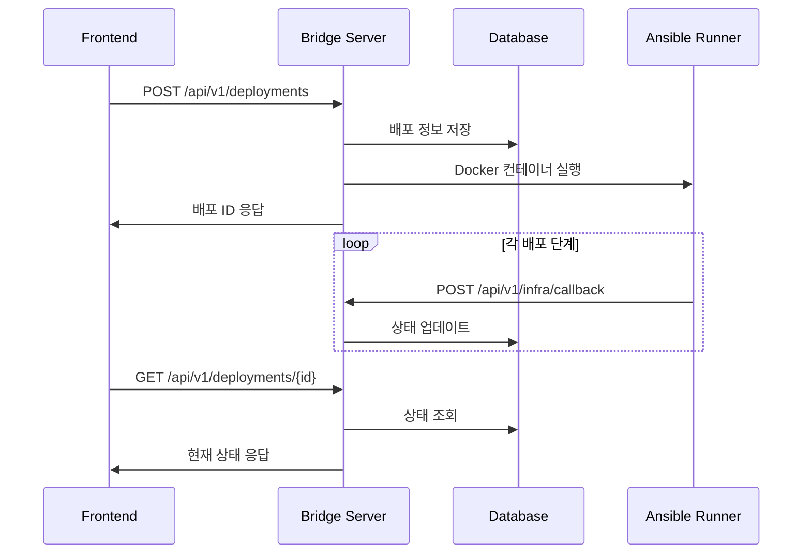

# Bridge Server

Ansible Runner와 Frontend 사이의 중간 서버 역할을 하는 Golang 웹 서버입니다. 배포 요청을 관리하고, Docker 컨테이너로 Ansible Runner를 트리거하며, 배포 진행 상황을 실시간으로 추적합니다.

## 🎯 주요 기능

- **배포 요청 관리**: REST API를 통한 배포 생성/조회
- **Runner 트리거**: Docker 컨테이너로 Ansible Runner 자동 실행
- **상태 추적**: 배포 단계별 실시간 상태 관리
- **콜백 처리**: Ansible Runner에서 보내는 진행 상황 수신
- **데이터 저장**: SQLite를 통한 배포 히스토리 관리

## 📁 프로젝트 구조

```
bridge-server/
├── main.go                 # 메인 애플리케이션
├── internal/
│   ├── api/
│   │   └── routes.go       # API 라우팅 설정
│   ├── handlers/
│   │   ├── deployment.go   # 배포 관련 핸들러
│   │   └── infra.go        # 인프라 콜백 핸들러
│   ├── models/
│   │   └── deployment.go   # 데이터 모델 정의
│   ├── database/
│   │   └── database.go     # 데이터베이스 연결
│   └── services/
│       └── runner.go       # Ansible Runner 트리거
├── go.mod                  # Go 모듈 정의
├── Dockerfile              # Docker 이미지 빌드
└── README.md
```

## 🚀 빠른 시작

### 1. 로컬 개발 환경

```bash
# 의존성 설치
go mod tidy

# 개발 서버 실행
go run main.go

# 서버 확인
curl http://localhost:8080/api/v1/health
```

### 2. 빌드 및 실행

```bash
# 바이너리 빌드
go build -o bridge-server

# 실행
./bridge-server

# 백그라운드 실행
nohup ./bridge-server > server.log 2>&1 &
```

### 3. Docker 사용

```bash
# Docker 이미지 빌드
docker build -t bridge-server .

# 컨테이너 실행
docker run -p 8080:8080 -v $(pwd):/app bridge-server
```

## 🔌 API 엔드포인트

### 배포 관리

#### 새 배포 생성
```http
POST /api/v1/deployments
Content-Type: application/json

{
  "name": "my-app",
  "docker_image": "nginx:alpine",
  "domain": "example.com",
  "env_config": "ENVIRONMENT=production"
}
```

**응답:**
```json
{
  "message": "배포가 시작되었습니다",
  "deployment": {
    "id": 1,
    "name": "my-app",
    "status": "pending",
    "docker_image": "nginx:alpine",
    "domain": "example.com",
    "created_at": "2024-01-01T00:00:00Z"
  }
}
```

#### 배포 목록 조회
```http
GET /api/v1/deployments
```

**응답:**
```json
{
  "deployments": [
    {
      "id": 1,
      "name": "my-app",
      "status": "running",
      "docker_image": "nginx:alpine",
      "domain": "example.com",
      "steps": [...]
    }
  ]
}
```

#### 특정 배포 조회
```http
GET /api/v1/deployments/{id}
```

#### 배포 단계 조회
```http
GET /api/v1/deployments/{id}/steps
```

**응답:**
```json
{
  "steps": [
    {
      "id": 1,
      "step_name": "route53",
      "status": "completed",
      "message": "DNS 설정 완료",
      "started_at": "2024-01-01T00:00:00Z",
      "completed_at": "2024-01-01T00:01:00Z"
    }
  ]
}
```

### 인프라 콜백

#### 상태 업데이트 (Ansible Runner → Bridge)
```http
POST /api/v1/infra/callback
Content-Type: application/json

{
  "deployment_id": 1,
  "step_name": "route53",
  "status": "running",
  "message": "DNS 설정 중..."
}
```

### 상태 확인

#### 헬스체크
```http
GET /api/v1/health
```

**응답:**
```json
{
  "status": "healthy",
  "service": "bridge-server",
  "time": "2024-01-01T00:00:00Z"
}
```

## 📊 데이터베이스 스키마

### Deployment 테이블
| 컬럼 | 타입 | 설명 |
|------|------|------|
| `id` | INTEGER | 배포 고유 ID (Primary Key) |
| `name` | VARCHAR | 배포 이름 |
| `status` | VARCHAR | 배포 상태 (pending, running, completed, failed) |
| `docker_image` | VARCHAR | 배포할 도커 이미지 |
| `env_config` | TEXT | 환경 설정 |
| `domain` | VARCHAR | 배포 도메인 |
| `created_at` | DATETIME | 생성 시간 |
| `updated_at` | DATETIME | 수정 시간 |

### DeploymentStep 테이블
| 컬럼 | 타입 | 설명 |
|------|------|------|
| `id` | INTEGER | 단계 고유 ID (Primary Key) |
| `deployment_id` | INTEGER | 배포 ID (Foreign Key) |
| `step_name` | VARCHAR | 단계 이름 (route53, load_balancer, ...) |
| `status` | VARCHAR | 단계 상태 (pending, running, completed, failed) |
| `message` | TEXT | 상태 메시지 |
| `started_at` | DATETIME | 시작 시간 |
| `completed_at` | DATETIME | 완료 시간 |

## 🔄 배포 플로우



## 🔧 설정

### 환경 변수
| 변수명 | 설명 | 기본값 |
|--------|------|--------|
| `PORT` | 서버 포트 | 8080 |
| `DB_PATH` | SQLite DB 경로 | bridge.db |

### CORS 설정
기본적으로 모든 Origin을 허용하도록 설정되어 있습니다. 프로덕션에서는 보안을 위해 제한하세요.

```go
// main.go에서 CORS 설정 수정
r.Use(func(c *gin.Context) {
    c.Header("Access-Control-Allow-Origin", "https://your-frontend.com")
    // ...
})
```

## 🧪 테스트

### 단위 테스트
```bash
go test ./internal/...
```

### API 테스트
```bash
# 서버 시작 후
curl -X POST http://localhost:8080/api/v1/deployments \
  -H "Content-Type: application/json" \
  -d '{"name":"test","docker_image":"nginx","domain":"test.com"}'

curl http://localhost:8080/api/v1/deployments
```

### 통합 테스트
```bash
# production-deploy 디렉토리에서
./scripts/test-deployment.sh full
```

## 🐛 문제 해결

### 일반적인 문제

1. **포트 충돌**
   ```bash
   # 다른 포트 사용
   PORT=8081 go run main.go
   ```

2. **데이터베이스 오류**
   ```bash
   # DB 파일 삭제 후 재시작
   rm bridge.db && go run main.go
   ```

3. **Docker 컨테이너 실행 실패**
   ```bash
   # Docker 서비스 상태 확인
   docker ps
   docker images | grep ansible-runner
   ```

4. **CORS 오류**
   ```bash
   # 개발용으로 모든 Origin 허용 확인
   curl -H "Origin: http://localhost:3000" \
        -H "Access-Control-Request-Method: POST" \
        -X OPTIONS http://localhost:8080/api/v1/deployments
   ```

### 로그 확인

```bash
# 서버 로그 (백그라운드 실행 시)
tail -f server.log

# 특정 배포의 Ansible 로그
docker logs ansible-runner-{deployment_id}
```

## 🔗 관련 문서

- **[Production Deploy](../production-deploy/README.md)** - Ansible Runner 시스템
- **[메인 프로젝트](../README.md)** - 전체 프로젝트 개요
- **[Production 가이드](../README-PRODUCTION.md)** - 전체 시스템 가이드

## 🔒 보안 고려사항

- 현재는 개발/테스트용 설정입니다
- 프로덕션에서는 다음을 고려하세요:
  - JWT 기반 인증
  - CORS 제한
  - Rate Limiting
  - HTTPS 사용
  - 민감한 정보 암호화

## 📈 확장 가능성

- 여러 Kubernetes 클러스터 지원
- 다양한 배포 전략 추가
- WebSocket을 통한 실시간 알림
- 배포 히스토리 분석 기능
- 롤백 기능 추가